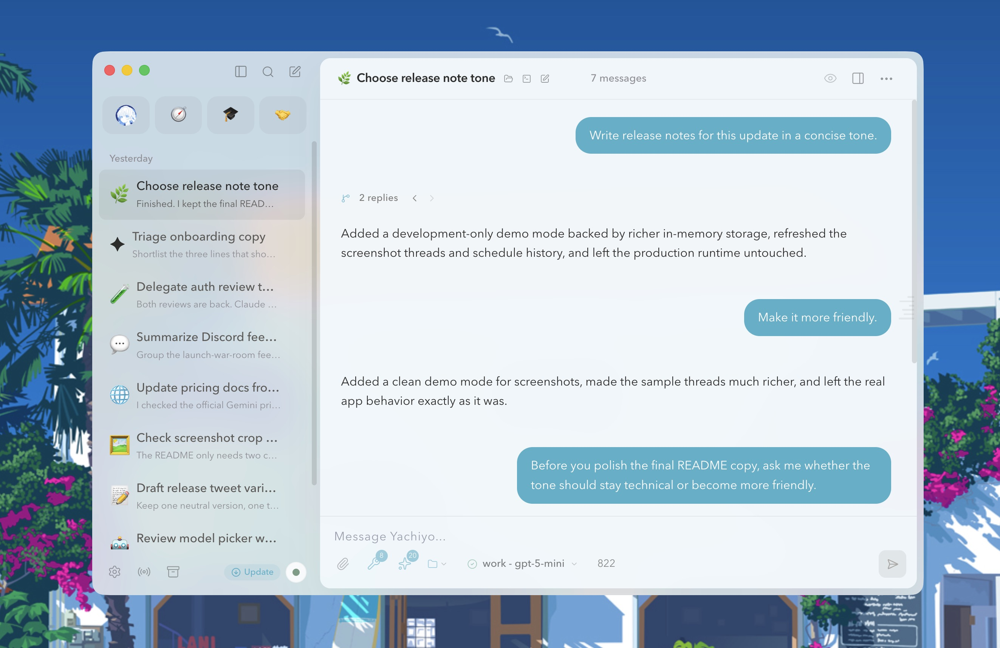
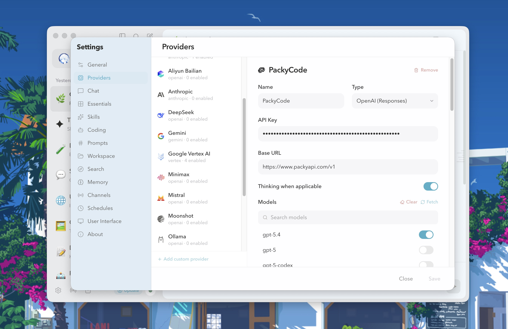
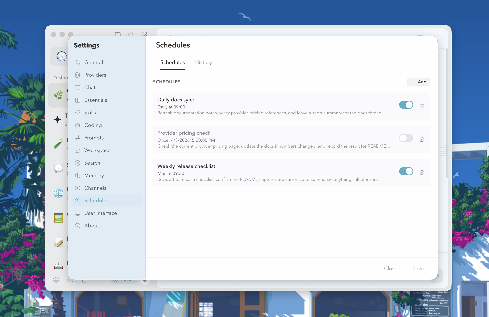
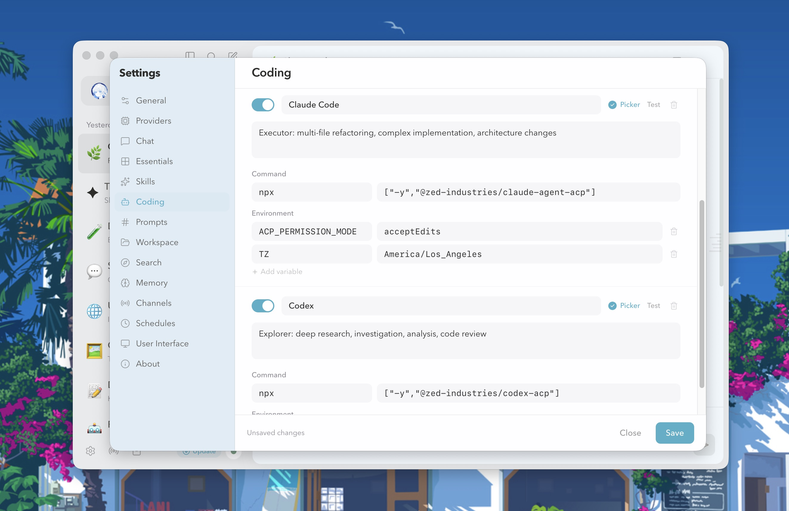
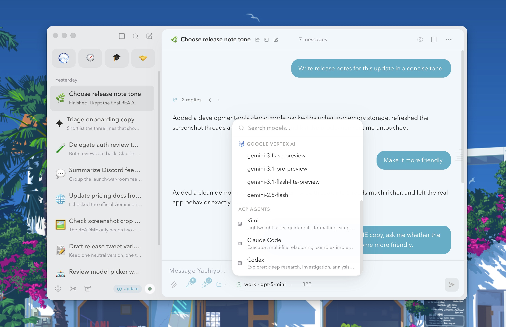
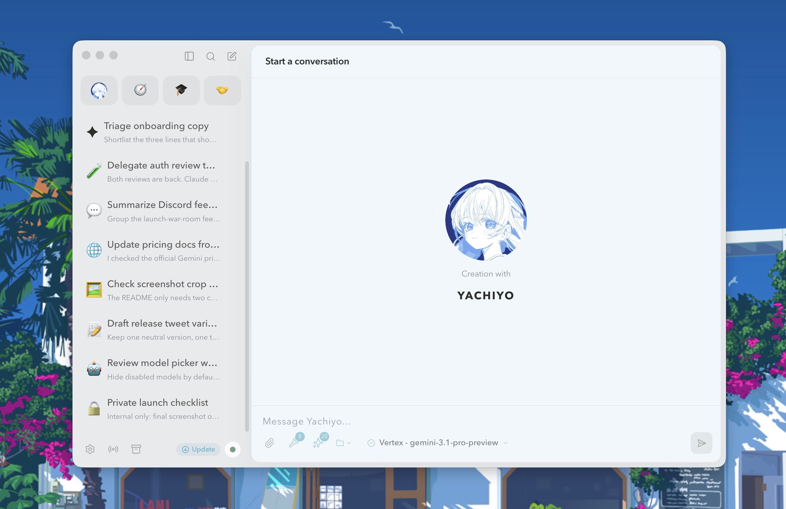

<div align="center">


# Yachiyo

An open-source alternative to [Alma](http://alma.now/).<br>
No MCP, no plugin marketplace, skills-only.<br>
Only what's necessary for a cyber-assistant that lives in your computer.

</div>

## Why Yachiyo?

Because your AI assistant should be yours — not a platform, not a marketplace, not a maze of configuration files.

Most AI clients want to become ecosystems. They invent protocols, build plugin stores, and lock you into their infrastructure. Yachiyo does the opposite: it gives you a capable assistant that lives in your filesystem, respects your privacy, and gets out of your way.

Skills are just Markdown. Drop a SKILL.md file in your workspace and it works. No runtime. No API surface. No 47-step setup. If you can write a README, you can extend Yachiyo.

No vendor lock-in. Claude today, Gemini tomorrow, your own local model next week. Switch per-message if you want. Your history stays local in SQLite — not in someone else's cloud.

Reply branching. Conversations aren't linear. Branch from any point, explore different paths, navigate the tree. It's how you actually think.

Channels, not silos. One local instance serves Telegram, Discord, and QQ simultaneously with shared context and access control.

No MCP. No telemetry. No plugin marketplace. Just what's necessary for a cyber-assistant that lives in your computer.

---

## Features

- **Fully agentic runtime** — Yachiyo can search, read, edit, browse, recall memory, ask follow-up questions, and act on your local workspace instead of staying a pure chat box.
- **Built-in general-purpose skills** — Core capabilities like browser work, document handling, spreadsheets, Zotero, terminal control, and CLI self-management ship as reusable skill modules.
- **Coding agent dispatch** — Delegate implementation work to Claude Code or Codex through ACP, then bring the result back into the same thread.
- **Scheduled runs** — Create one-off or cron-based tasks, keep run history, and let Yachiyo execute prompts on its own.
- **Reply branching** — Messages form a tree. Branch from any turn and navigate alternate replies instead of flattening everything into one timeline.
- **Channel multiplexing** — Serve Telegram, QQ (OneBot), and Discord from one local instance with shared context, access control, and per-user limits.
- **Group discussion mode** — Built-in lurk/active/engaged state machine for group chats, with buffered context and autonomous participation.
- **Browser-backed web research** — Search with Google browser sessions or Exa, then read pages into Markdown/HTML with extraction fallbacks.
- **Local memory & profile** — Store durable memory, recall it into future runs, and keep `SOUL.md` / `USER.md` as first-class context.
- **Multi-provider runtime** — Anthropic, OpenAI, Gemini, Vertex AI, or custom gateway, with model selection inside the app.
- **Local-first storage** — SQLite + Drizzle ORM under `~/.yachiyo/`, with no hosted backend required.

## Screenshots

### Reply branching



_Compare different tones and keep the path you actually want without losing the other replies._

### Providers



_Configure providers locally, choose runtime behavior, and manage enabled models from one place._

### Schedules



_Run prompts on a schedule, keep history, and treat recurring work like a first-class feature instead of a hack._

### Coding agents



_Register coding agents, tune their launch command and environment, and keep them ready for delegation._

### Model and agent picker



_Switch between normal models and ACP-backed coding agents directly from the composer._

### Essentials



_A focused essentials surface for keeping important context, reusable items, and workspace shortcuts close at hand._

## Showcases

### Multi-Agent Dispatch & Coordination

"I have Claude Code and Codex working on different parts of the auth refactor. Send a prompt to both to 'run the latest migration and verify the schema,' then notify me when they finish."

> Yachiyo acts as your central dispatcher. It handles the complex task of prompting multiple specialized agents, monitoring their progress through the Agent Client Protocol (ACP), and synthesizing their results into a single update.

### Real-Time Digital Foraging

"Find the latest Gemini 3.1 Pro pricing and update the project's provider configuration with the new rates."

> Using a real, authenticated browser, Yachiyo navigates live documentation, extracts structured data (even from the newest 2026 models), and applies those updates to your local setup. It automates the "boring" research to keep your environment current.

### Living Persona & Shared Context

"I want my responses to be more technical and concise. Update my profile and adjust your future behavior."

> Yachiyo manages its own soul and your user profile through local Markdown files (`SOUL.md` and `USER.md`). Your preferences aren't just settings—they are a durable, evolving memory that shapes every interaction across all channels.

---

## Getting Started

Download the latest release from the [Releases](https://github.com/ringotypowriter/yachiyo/releases) page. macOS only for now.

## Development

```bash
nvm use
pnpm install
pnpm dev
```

## Contributing

Bug fixes and documentation improvements are welcome.

Feature PRs are **not accepted** unless the feature has been widely discussed and approved through an issue proposal first. Open an issue before writing code.

## Special Thanks

- [Alma](http://alma.now/) — the original inspiration for this project
- [Defuddle](https://github.com/kepano/defuddle) — powers the web reader extraction, such a good tool
- [Cahciua](https://github.com/Menci/Cahciua) — group message structure reference
- [Flowdown](https://flowdown.ai/) — thread emoji icon inspiration

## License

[Apache-2.0](LICENSE)

The Yachiyo name, logo, and branding assets are not covered by this license and remain all rights reserved. See [NOTICE](NOTICE) for details.
